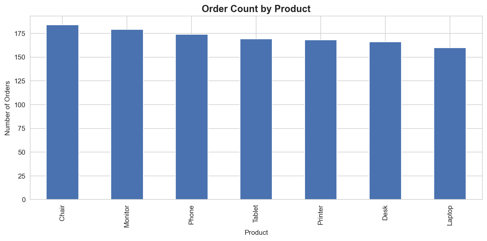
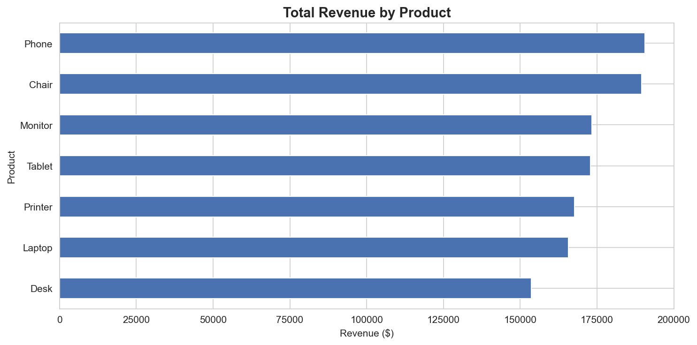
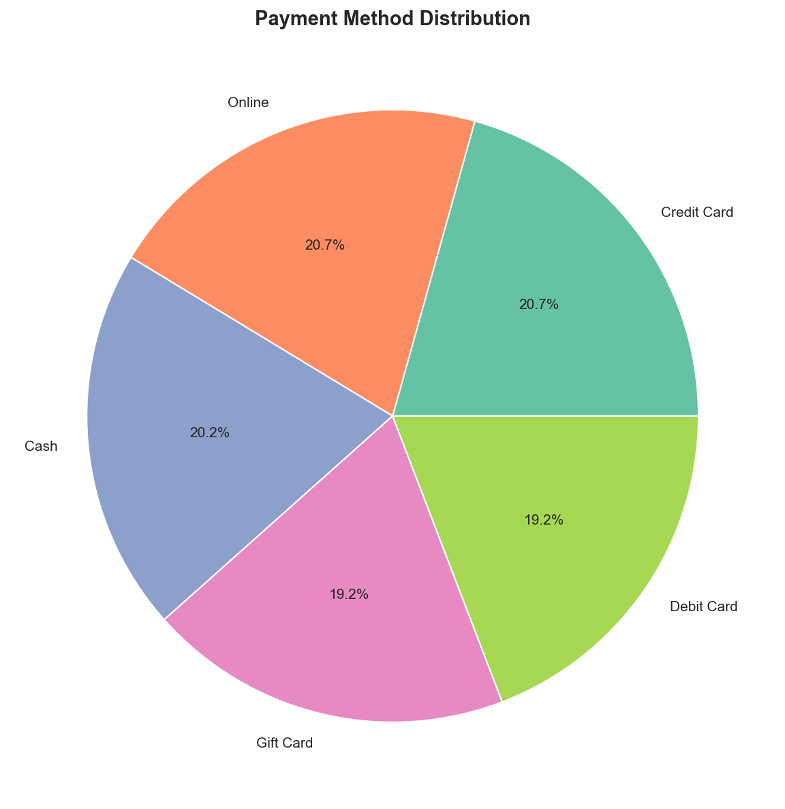
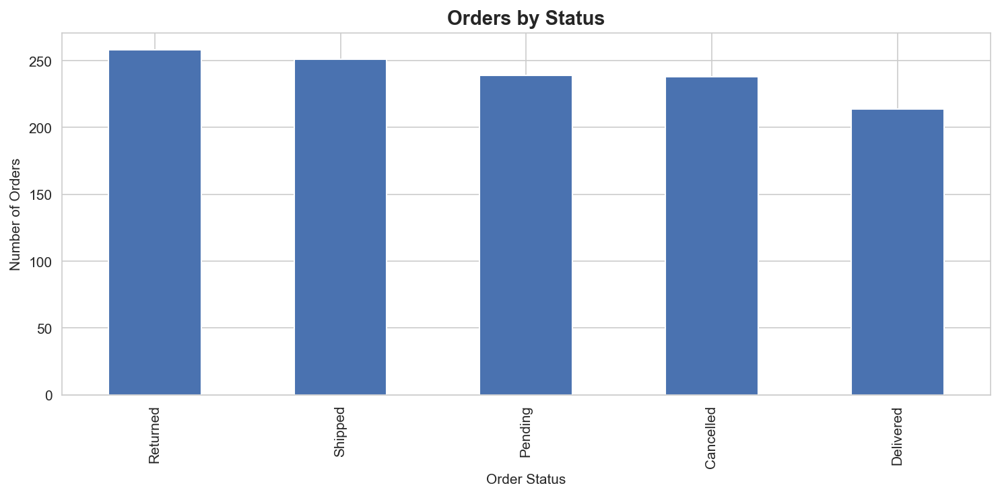
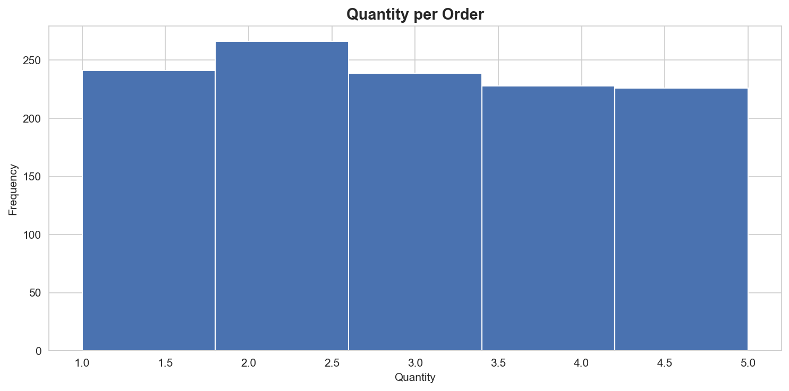
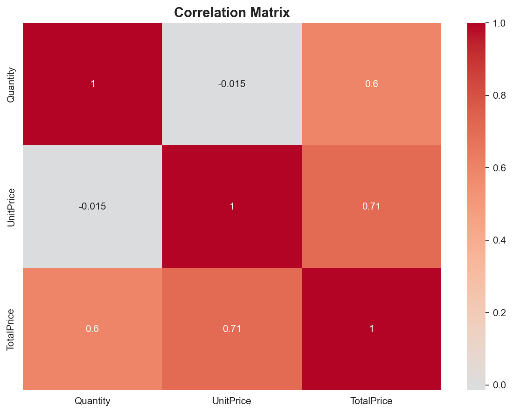

# Decode Labs — Exploratory Data Analysis

I built this notebook during my internship at Decode Labs. It walks through a basic exploratory data analysis on a synthetic e-commerce dataset using pandas, matplotlib, and seaborn.

---

## Charts

### 1. Order Count by Product

The products are fairly evenly distributed — no single category dominates the order count. Printer leads slightly, Phone trails a bit.

### 2. Revenue by Product

Revenue tells a different story. Chair and Printer bring in the most, Phone is noticeably behind despite having a similar order count to everything else. Probably a unit price thing.

### 3. Payment Method Distribution

Pretty close split across all five methods. Online edges ahead slightly. No single method is dominant.

### 4. Orders by Status

The dataset looks like it was balanced on purpose — each status has roughly the same number of orders. This is synthetic data after all.

### 5. Quantity per Order

Most customers buy 1–2 items. The count drops as quantity goes up. Makes sense.

### 6. Correlation Matrix

Quantity and TotalPrice have a moderate positive correlation. UnitPrice and TotalPrice don't correlate much, which is a bit surprising — probably because higher-priced items tend to be bought in smaller quantities.

---

## Dataset

1200 rows of synthetic order data. The columns are:

`OrderID`, `Date`, `CustomerID`, `Product`, `Quantity`, `UnitPrice`, `ShippingAddress`, `PaymentMethod`, `OrderStatus`, `TrackingNumber`, `ItemsInCart`, `CouponCode`, `ReferralSource`, `TotalPrice`

The Excel file (`Dataset for Data Analytics (2).xlsx`) is not in this repo. You'll need it to run the notebook.

## Stack

Python with pandas, matplotlib, seaborn. Runs on Google Colab.

## How to run

Open the notebook in Google Colab, upload the Excel file, and run all cells. No extra setup needed — Colab comes with everything pre-installed.
